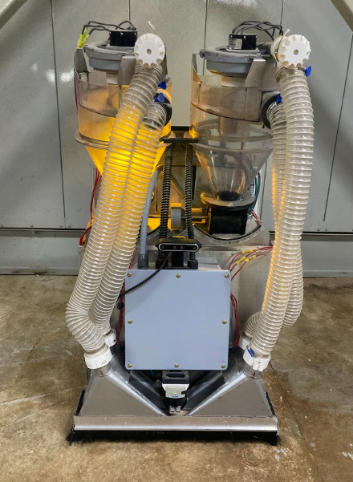
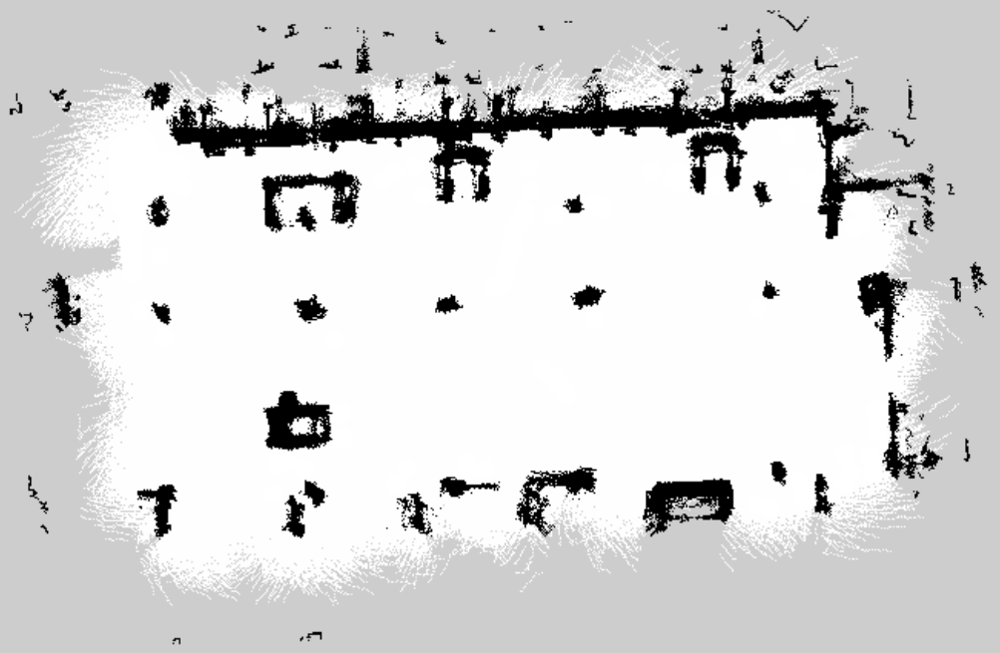

# *Sucky — Autonomous Cleaning Robot*

  

This repo contains all the real robot work for **Sucky, an autonomous cleaning robot** developed during my summer internship at **Hampton Lumber**.
This repository focuses on the actual deployment of the system, bridging the gap between simulation and the physical robot operating in a complex sawmill environment. 

Looking for the simulation side of this project?
You can find it here: [*Sucky — Autonomous Cleaning Robot Simulation Environment*](https://github.com/jkoubs/sucky_ws).

# Table of Contents
- [About](#about)  
  - [Goals](#goals)  
- [Technical Approach](#technical-approach)  
  - [Hardware](#hardware)  
  - [Software Stack](#software-stack)  
  - [Key Contributions](#key-contributions)  
- [Results](#results)  
  - [3D SLAM with RTAB-Map](#3d-slam-with-rtab-map)  
  - [Full Coverage Path Planning](#full-coverage-path-planning)
  - [Cleaning Demo](cleaning-demo)
- [Ideas for Improvement](#ideas-for-improvement)  
- [Acknowledgments](#acknowledgments)  

# About

Sucky is an **autonomous cleaning robot** with one mission: **to keep a busy sawmill clear of wood dust**.

In an environment filled with airborne dust, piles of debris, and workers, cleaning is no simple task.
Sucky must navigate safely, avoid obstacles, and cover every corner — all on its own.

This repo shares the journey of taking Sucky from simulation to the real world, adapting its smarts and sensors to handle the challenges of keeping a sawmill clean and dust-free.

## Goals

- Deploy SLAM, navigation and coverage planning from simulation to the real robot.

- Handle **real-world complexities** such as dust interference, dynamic obstacles, and uneven flooring.

- Tune and validate **Full Coverage Path Planning** for reliable, systematic cleaning.

- Develop a robust platform for **future industrial-scale deployments**.

# Technical Approach 

## Hardware

 - **Drive Base:** Two powered drive wheels combined with two free-spinning mecanum caster wheels for stability.
The robot uses a **differential drive configuration** to control movement, making it simple yet effective for navigating industrial environments like a sawmill.

 - **LiDAR:** Sick TIM781 for accurate and reliable obstacle detection.

 - **Depth Camera:** Intel RealSense D455 equivalent for 3D perception and SLAM.

 - **Computer:** Jetson Orin Nano.

 - **Microcontroller:** Arduino Integration for vacuum and cleaning peripherals.

## Software Stack
 - **Framework:** ROS 2 Humble, Foxglove.
 - **Simulator:** Gazebo.
 - **Nav2 Stack:** Provides navigation, planning, and autonomous movement.
 - **RTAB-Map:** For 3D mapping and localization.

## Key Contributions

- **3D Mapping:** Built a two-step mapping process with RTAB-Map to handle the sawmill’s complex environment.

  - During mapping, set `MaxObstacleHeight` to `2.0` meters to capture tall features and improve loop closure.

  - In post-processing, lowered `MaxObstacleHeight` in `RTAB-Map Database Viewer` to match the robot’s height, creating a clean 2D map for navigation and catching obstacles the LiDAR alone might miss.

 - **Behavior Trees (BTs):** A custom behavior tree was developed to integrate **SpiralSTC** planning, based on the [Full Coverage Path Planner](https://github.com/nobleo/full_coverage_path_planner) repo from [nobleo](https://github.com/nobleo/full_coverage_path_planner).

- **Coverage Planning:** Implemented the [Full Coverage Path Planning (FCPP)](https://github.com/nobleo/full_coverage_path_planner) planner plugin in ROS 2 for systematic cleaning. Added a an **interpolation_resolution** parameter for better fine-tuning

- **Navigation:** Tuned **Nav2** parameters for robust real-world navigation, with a major focus on the **controller_server** and [MPPI (Model Predictive Path Integral)](https://docs.nav2.org/configuration/packages/configuring-mppic.html) controller for robust path following and dynamic obstacle handling.

- **LiDAR and Camera Filtering:** Designed and implemented filtering strategies to handle **airborne dust**, a major challenge in the sawmill environment.

# Results

This section highlights the final implementation and real-world validation of the **Full Coverage Path Planning** system on the physical robot.

For **step-by-step instructions on deploying and running the robot**, please refer to the [Deployment Guide](deployment_guide.md)
.

## 3D SLAM with RTAB-Map

  

From this 3D map, we can extract the point cloud data:

  

This 3D map allows us to extract a 2D slice that will serve as the base for navigation:

  

## Full Coverage Path Planning

  

## Cleaning Demo

  

# Ideas for Improvement

For a more detailed explanation of these improvements, please check [Improvements Report](Improvements.md).

Looking ahead, there are **three primary areas for improvement** that will significantly enhance the system’s performance, robustness, and usability:

- **Enhanced dynamic obstacle avoidance strategy**

- **Integrating Opennav Coverage into the real robot for finer control of coverage areas**

- **Adding higher-level error handling and notification logic**

Some other future enhancements worth exploring with lower priority include:

- **Hose detection pipeline**

- **Automated dumping process**

- **Automated charging**

- **Cleaning progress & robot status dashboard**

# Acknowledgments

I would like to thank **Hampton Lumber** for the opportunity to work on this project and gain hands-on experience in robotics during my internship.

Special thanks to **George Fox University** for developing the physical robot chassis that served as the foundation for this work.

I also want to recognize my fellow interns for their collaboration and contributions:

**Alexander Roller** — Robotics Engineer — [@AlexanderRoller](https://github.com/AlexanderRoller)

**Benjamin Cantero** — Mechanical Lead

**Jason Koubi (myself)** — Robotics Software Developer — [@jkoubs](https://github.com/jkoubs)

Finally, thanks to the open-source community and the following projects, which were essential to this work:

[full_coverage_path_planner](https://github.com/nobleo/full_coverage_path_planner)
 — Main coverage planning solution and SpiralSTC integration.

[opennav_coverage](https://github.com/open-navigation/opennav_coverage)
 — Alternative coverage planning strategy for simulation.