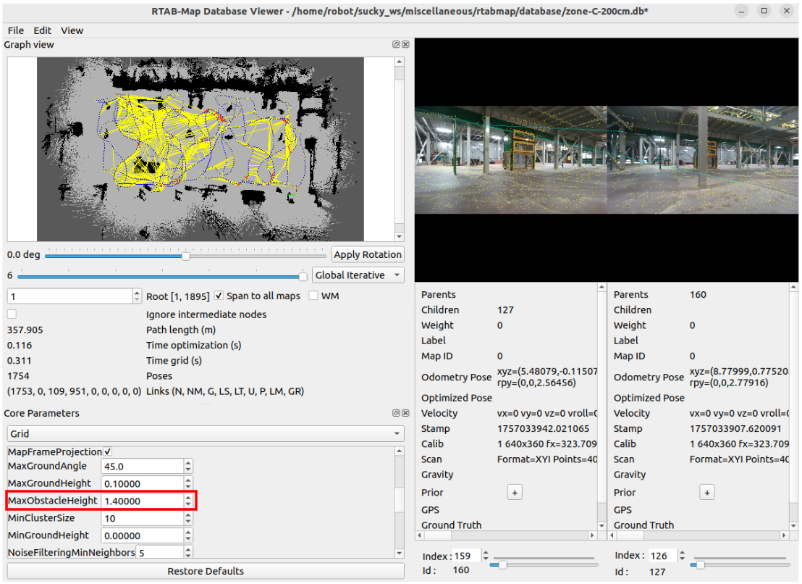

# Deployment Guide

## 3D Mapping

- Bringup robot:

```bash
cd ~/sucky_real_ws
colcon build
source install/setup.bash
ros2 launch sucky_bringup bringup.launch.py
```

- Launch RTAB-Map:

```bash
cd ~/sucky_real_ws
colcon build
source install/setup.bash
ros2 launch sucky_nav rtabmap.launch.py
```

- Post map processing with `rtabmap-databaseViewer`:
```bash
rtabmap-databaseViewer ~/.ros/rtabmap.db
```

<div align="center">
  
</div>

From the database you can do some post processing and debugging. Here we have lowered `MaxObstacleHeight`  from `2.0` meters to `1.4` meters in `RTAB-Map Database Viewer` to match the robot’s height, creating a clean 2D map for navigation and catching obstacles the LiDAR alone might miss.

You could also **export the 3d point cloud data and the 2d map**.

[▶ Watch RTAB-Map Demo](https://drive.google.com/file/d/1H60fA8peap0IDlCbI1Gu_mGmpk1Iw4iS/view?usp=sharing)

## Collect RTAB-Map Input Topics for Offline Mapping

```bash
ssh_sucky
ros2 launch sucky_bringup bringup.launch.py
ros2 bag record \
  --compression-mode file \
  --compression-format zstd \
  -o ~/bags/rosbag2_$(date +%Y_%m_%d-%H_%M_%S) \
  /diffbot_base_controller/odom \
  /camera/d455/color/camera_info \
  /camera/d455/color/image_raw/compressed \
  /camera/d455/depth/image_rect_raw/compressedDepth \
  /scan \
  /tf \
  /tf_static
```

## Full Coverage Path Planning 

- Bringup robot:

```bash
cd ~/sucky_real_ws
colcon build
source install/setup.bash
ros2 launch sucky_bringup bringup.launch.py
```
- Launch RTAB-Map localization:

```bash
cd ~/sucky_real_ws
colcon build --packages-select sucky_nav
source install/setup.bash
ros2 launch sucky_nav rtabmap_localization.launch.py
```

- Dont forget to launch Foxglove for vizualization and **set a 2D Initial pose**:

```bash
ros2 launch foxglove_bridge foxglove_bridge_launch.xml port:=8765
```

- Launch Full Coverage Path Planner:

```bash
colcon build --packages-select sucky_nav
source install/setup.bash
ros2 launch sucky_nav fcpp_all.launch.py
```

**Finally you just need to trigger navigation in Foxglove by setting a goal pose anywhere in the map.**


[▶ Watch Full Coverage Path Planning Demo](https://drive.google.com/file/d/1f9pqH224ezJdJbsfCKudRruhQarW7Mpy/view?usp=sharing)


[▶ Watch Cleaning Demo](https://drive.google.com/file/d/1JkRt5GwfBvF_SHl-lVtkX9OxRZKRe9P_/view?usp=sharing)
